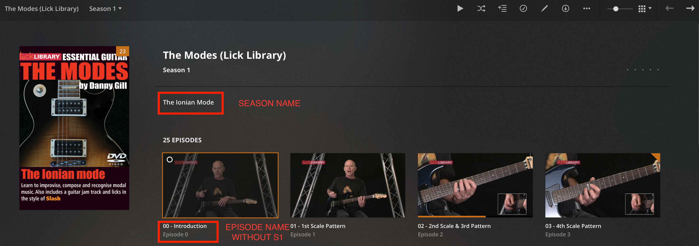
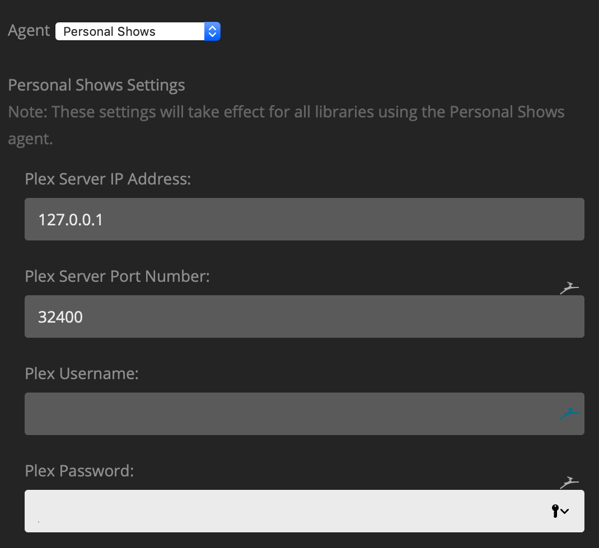
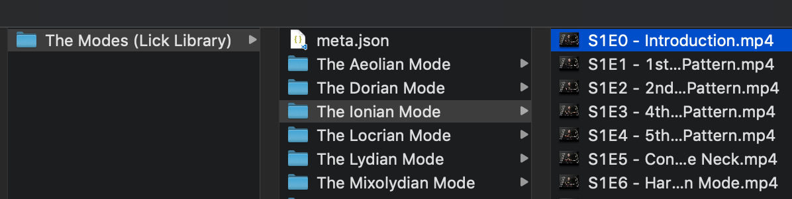

# Personal Shows Metadata Agent For Plex

This agent helps manage personal shows like tutorials, home videos which are not available on TVDB or any other online metadata sources.

## Final Output

1. All your Personal Shows will be displayed as TV shows with seasons and episodes.
1. The season will have its title stored as `summary`.
1. Episodes will derive their names from the file names excluding the `S1E1` part to make them cleaner.
1. Each Show can have its custom poster.
1. Each Season can have its custom poster.
1. You can also add a set of values for fields like `studio`, `cast` etc.




## Installation

1. Download the latest release zip from the Releases Page.
1. Extract.
1. Delete the `docs` folder if you think the size is too big. It contains the images shown in this readme.
1. Rename the downloaded folder from `---.bundle-master` to `---.bundle`.
1. Place it in `~/Library/Application Support/Plex Media Server/Plug-Ins` directory.

## Configuration

Choose `Personal Shows` agent in `Advanced` section of your library.

### Preferences

There is a bug in Plex where it does not update the database with season summary from the XML. So, to get around it, this agent updates the summary using the HTTP API. To do that, it needs to generate an API token. That is why, it requires the network information and the credentials to your plex. However, if you don't feel good about typing the credentials, you can simply leave all the fields empty and the agent will not update the season's summary with folder name.

Just note that the credentials never leave your network as long as your plex is on the local network. So its not any more unsafe than lets say adding your opensubtitles credentials. But, up to you!



### Naming

Name your shows in the following manner:

```
Tutorials
--- Guitar Scales # This is the show name
------ cover.jpg # default poster for the show
------ The Ionian Mode # This is the Season or group name
---------- cover.jpg # default poster for the season
---------- S1E0 - Introduction # This is the first episode of season 1. You can use E1 as well.
```



#### Just make sure that you DON'T pad the season and episode numbers for 0s. For example, use S1E1 instead of S01E01. Otherwise, the Episode names will contain S01E01 section in plex as well.

## Additional Metadata

You can add additional metadata like posters etc. To do that, create a `meta.json` file in the root of your TV Show. For example, `Guitar Scales/meta.json`. Following keys are available

```
{
    "actors": [{
        "name": "Danny Gill",
        "role": "Guitarist",
        "photo": "https://example.com/actor_avatar" // This must be a URL. It seems like plex does not support local files for cast.
    }],
    "publisher": "Lick Library",
    "collections": ["Collection 1", "Collection 2"],
    "available_at": "YYYY-MM-DD",
    "tags": ["Tutorials", "Guitar", "Music Theory"],
    "show_thumbnail": "https://example.com/show_poster", // defaults to cover.jpg in the show root folder. can be a relative path in show folder
    "season_thumbnails": {
        "1": "https://example.com/season_1_poster", // defaults to cover.jpg in the season folder
        "2": "poster.png" // season_2/poster.png relative path to the cover in season folder
    }
}
```
